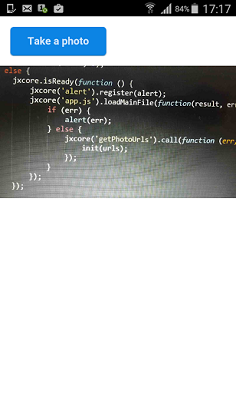

## Sample JXcore cordova app for saving photos in sqlite db



Supposing you have already installed [JXcore](http://jxcore.com/downloads/) and cordova globally, now install local npm modules:

```bash
jx install
```

To run on android just type:

```bash
jx npm run-script run-android
```

Notes!

1. Gulp tasks take care of installing plugins, but if you copy a sample manually, don't forget to install the camera plugin.
2. Low ram devices (ram <= 512mb) **may** terminate app due to lack of memory.
